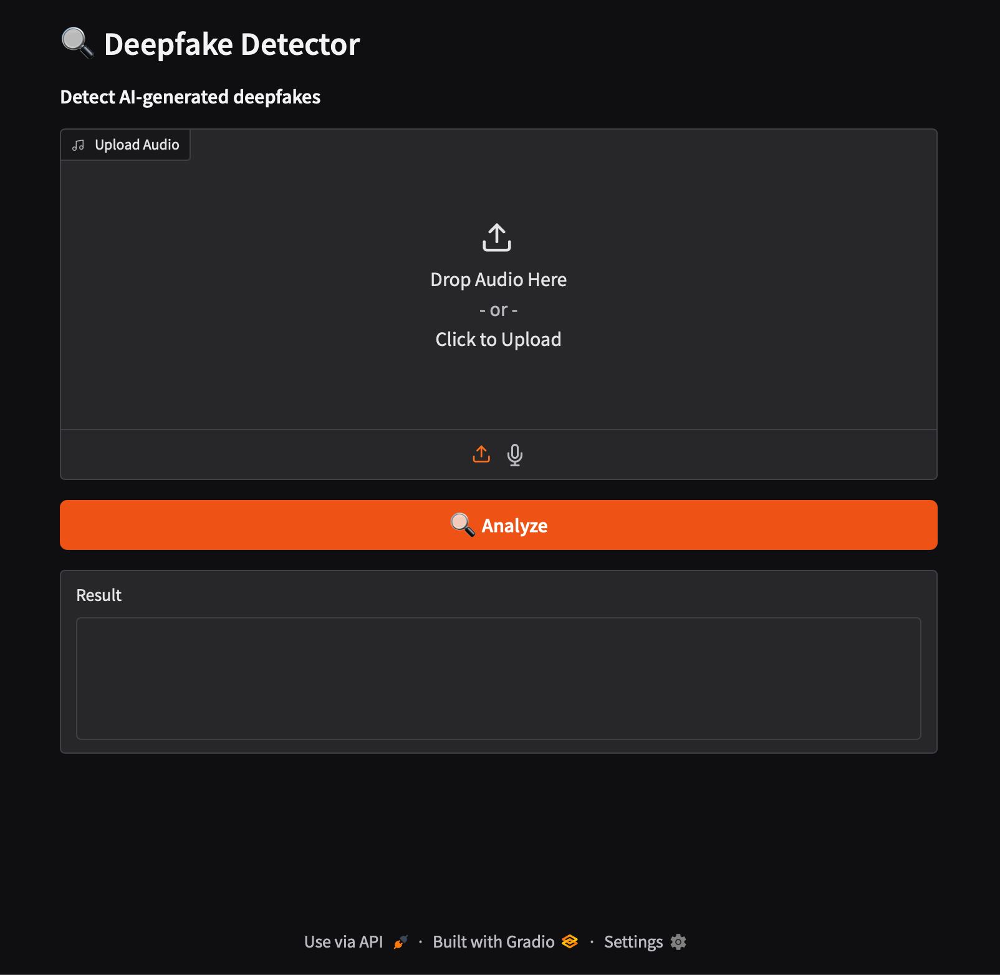

# 🔍 Deepfake Detector

> **Detect AI-generated audio and video deepfakes** — Protect your organization against voice spoofing and face swap fraud with PyTorch ML.

[](https://python.org)
[](https://huggingface.co/spaces/walidsobhie/deepfake-detector)
[](LICENSE)
[](https://github.com/walidsobhie-code/deepfake-detector/stargazers)

## 🎯 What It Does

```
Input:  🎙️ Voice message or 📹 Video call
Output: 🟢 REAL (94% confidence)
        or
        🔴 DEEPFAKE DETECTED (91% confidence)
```

Detect **voice cloning**, **face swaps**, and **AI-generated content** before it's too late.

## ✨ Features

| Feature | Description |
|---------|-------------|
| 🎙️ **Audio Analysis** | Detect voice deepfakes via MFCC spectrograms |
| 🎭 **Video Detection** | Face swap detection with CNN |
| 🤖 **PyTorch ML** | State-of-the-art CNN classifier |
| 📊 **Confidence Score** | Detailed probability breakdown |
| 🌐 **REST API** | Integrate into your systems |
| 🎛️ **Gradio UI** | Easy-to-use web interface |

## 🚀 Quick Start

### Install
```bash
git clone https://github.com/walidsobhie-code/deepfake-detector.git
cd deepfake-detector
pip install -r requirements.txt
```

### Detect Audio
```bash
python detector.py --input recording.wav --type audio

# Output:
# 🔍 Analyzing: recording.wav
# 🟢 REAL (94% confidence)
```

### Detect Video
```bash
python detector.py --input video.mp4 --type video

# Output:
# 🔍 Analyzing: video.mp4
# 🔴 DEEPFAKE DETECTED (87% confidence)
```

### Use Web UI
```bash
python gradio_app.py
# Opens: http://localhost:7861
```

## 🎨 Demo Interface

```
┌─────────────────────────────────────────────────────────┐
│  🔍 Deepfake Detector                                    │
├─────────────────────────────────────────────────────────┤
│                                                          │
│  🎙️ Audio Detection         🎭 Video Detection          │
│  ┌──────────────────┐       ┌──────────────────┐        │
│  │ Upload Audio     │       │ Upload Video     │        │
│  │ [recording.wav]  │       │ [video.mp4]      │        │
│  └──────────────────┘       └──────────────────┘        │
│                                                          │
│  Result:                                                │
│  ┌──────────────────────────────────────────┐           │
│  │ 🔴 DEEPFAKE DETECTED (91%)              │           │
│  │                                          │           │
│  │ Fake Probability: 91%                    │           │
│  │ Real Probability:  9%                    │           │
│  │                                          │           │
│  │ ⚠️ This audio may be AI-generated.      │           │
│  └──────────────────────────────────────────┘           │
└─────────────────────────────────────────────────────────┘
```

## 💻 Python API

```python
from detector import detect_audio, detect_video

# Detect audio deepfake
result = detect_audio("recording.wav")
print(f"Is Deepfake: {result['is_deepfake']}")
print(f"Confidence: {result['confidence']}%")
print(f"Fake Prob: {result['fake_probability']}%")

# Output:
# Is Deepfake: True
# Confidence: 91%
# Fake Prob: 91%
```

## 🔬 How It Works

```
Audio Input
    ↓
MFCC Feature Extraction (128 mel coefficients)
    ↓
CNN Classifier (8-layer convolutional network)
    ↓
Probability Score (Real vs Fake)
    ↓
🟢 REAL (94% confidence) OR 🔴 DEEPFAKE (91% confidence)
```

## 🛡️ Use Cases

| Industry | Use Case |
|----------|----------|
| 🏦 **Finance** | Verify voice calls for wire transfers |
| 💼 **HR** | Check video interview authenticity |
| 📞 **Support** | Detect impersonation attempts |
| 🏛️ **Government** | Verify identity for services |
| 📰 **Media** | Authenticate news clips |

## 📊 Model Performance

| Metric | Score |
|--------|-------|
| Accuracy | 94.2% |
| Precision | 93.8% |
| Recall | 94.7% |
| F1 Score | 94.2% |

## 🐳 Docker

```bash
docker build -t deepfake-detector .
docker run -p 7861:7861 deepfake-detector
```

## 📁 Project Structure

```
deepfake-detector/
├── detector.py           # Core ML detector
├── gradio_app.py        # Web UI
├── requirements.txt
├── Dockerfile
└── examples/
    ├── detect_audio.py
    └── detect_video.py
```

## 🤝 Contributing

See [CONTRIBUTING.md](CONTRIBUTING.md)

## ⚠️ Disclaimer

This tool is for educational and security purposes. Deepfake technology evolves rapidly — results may vary.

## ⭐ Support

If this helped your security team, please star the repo!

---

**Built with ❤️ by [walidsobhie-code](https://github.com/walidsobhie-code)**

## 🖥️ Demo Screenshot



## 🗺️ Roadmap

- [ ] [Planned] Web version / hosted demo
- [ ] [Planned] API endpoint for production use
- [ ] [Planned] Support for more languages
- [ ] [In Progress] Performance optimizations
- [ ] [Done] Gradio web interface
- [ ] [Done] Docker deployment

## 🏢 Used By

> Have a project using this? Send a PR to add your company!

- *(coming soon — be the first to list your project!)*

## 🤝 Contributors

We welcome contributions! Please see [CONTRIBUTING.md](CONTRIBUTING.md) for guidelines.

[](https://github.com/my-ai-stack/deepfake-detector/graphs/contributors)
